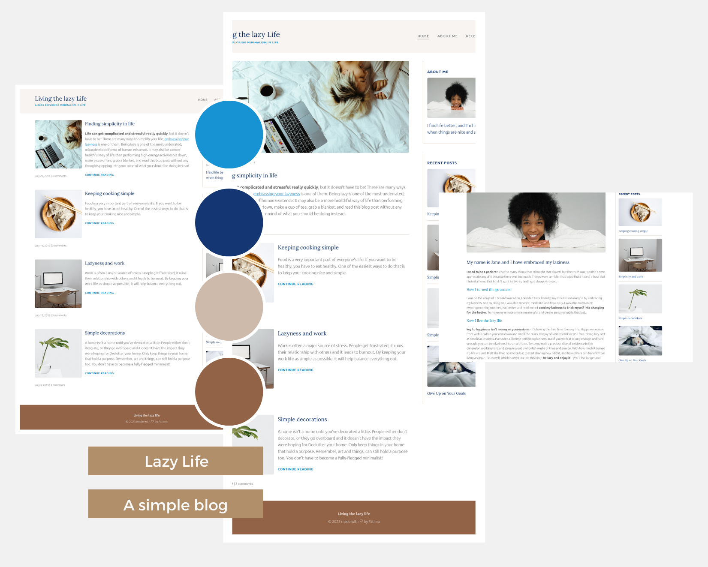

# Living the Lazy Life

Fully responsive blog exploring minimalism in life using HTML and CSS

## Table of contents

- [Overview](#overview)
  - [Description](#description)
  - [Screenshots](#screenshots)
  - [Links](#links)
- [Built with](#built-with)
- [Files and Directories](#files-and-directories)
- [Installation](#installation)
- [Author](#author)

## Overview

### Description

Living the Lazy Live is a simple blog website that aims to share tips and ideas for leading a minimalist lifestyle. The blog is focused on helping people declutter their lives, simplify their possessions, and find more joy and peace in the present moment. This website is build with HTML, CSS, and Vanilla JavaScript.

### Screenshots

### Links

- Solution URL: [https://github.com/fatima-xs/lazy-life-blog](https://github.com/fatima-xs/lazy-life-blog)
- Live Site URL: [https://lazy-life-fatima.netlify.app/](https://lazy-life-fatima.netlify.app/)

## Built with

## Files and Directories

- index.html : the homepage
- about-me.html : the About Me page
- recent-post.html : the recent posts page
- index.css : the css page
- images : the directory containing the images

## Installation

- Clone this repository to your desktop
- Navigate to the top level of the directory
- Open ./index.html in your browser

## Author

### Fatimata Ndiaye

